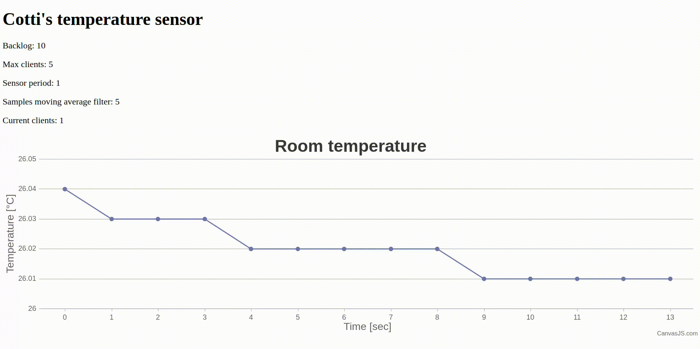
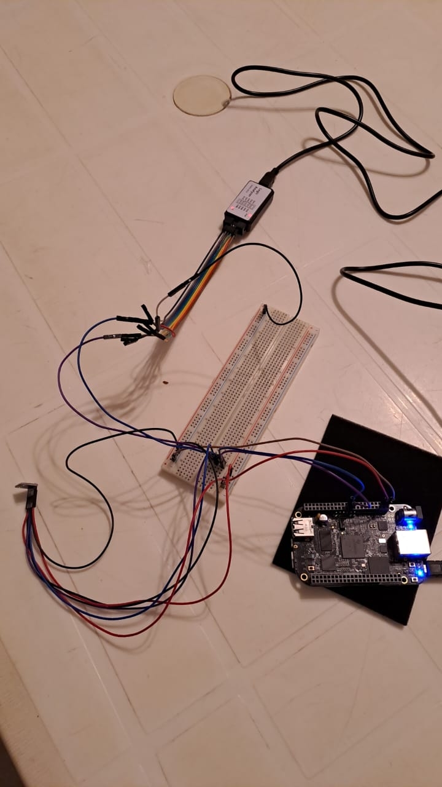
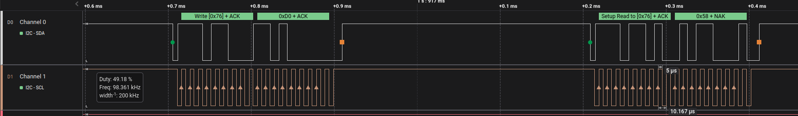

# Sensor de temperatura I2C con drivers de Linux y servidor web

## Instalación y ejecución

Para instalarlo y/o ejecutarlo, simplemente correr el script `install.sh`.

Probablemente deba instalar varios paquetes en su BeagleBone y modificar la función `internet_over_usb` con los nombres de sus redes.

El driver fue instalado con la versión de [kernel v5.10.168-ti-r71](https://github.com/beagleboard/linux/tree/v5.10.168-ti-r71), usando la imagen de la BeagleBone Black [AM335x 11.7 2023-09-02 4GB microSD IoT](https://www.beagleboard.org/distros/am335x-11-7-2023-09-02-4gb-microsd-iot)

## Driver

El dispositivo usado es el [sensor de temperatura BMP280 de Bosch](https://cdn-shop.adafruit.com/datasheets/BST-BMP280-DS001-11.pdf).

El driver de Linux configura el I2C, usando un *device tree overlay* sobre el device tree original (la habilitación de device tree overlays se hace de manera automática en el script de instalación).

El driver crea un character device de nombre `/dev/temp_sensor`, cuya funcionalidad se ejemplifica en el archivo `driver/user_test.c`.

El conexionado del sensor se muestra en la Fig. 1, y se detalla en la siguiente tabla:

| VCC  | GND  | SCL   | SDA   | CSB  | SDO  |
|------|------|-------|-------|------|------|
| P9.3 | P9.1 | P9.21 | P9.22 | P9.4 | P9.2 |

Figura 1. Conexiado del sensor BMP280 con la BeagleBone Black y un analizador lógico.

El trazo del analizador lógico completo se encuentra en el archivo `/images/driver_i2c.sal`, en la Fig.2 se muestra un detalle de la misma, leyendo el ID del dispositivo.

Figura 2. Lectura del ID del dispositivo 0x58, desde la dirección 0xD0.

## Server

El servidor está basado en una librería propia de C++ llamada [CCotti](https://github.com/ncotti/CCotti), la cual fue desarrollada usando CMake y testeada usando el framework de [GoogleTest](https://google.github.io/googletest/).

El servidor se actualiza en tiempo real usando AJAX y un script de JavaScript embebido en el HTML.

La cantidad de clientes no se cuenta con la cantidad de hijos creados por el servidor, la justificación es la siguiente:

1. Si el tipo de conexión es *keep-alive*, entonces un único hijo se crea para atender la totalidad de las pestañas abiertas en una misma ventana del navegador web (un hijo para "N" pestañas).

2. Si el tipo de conexión es *close*, entonces se crea un hijo por cada request, lo cual incluye `GET /`, `GET /images/favicon.ico`, `GET /update`, etc.

3. Si se usa el navegador web *Google Chrome*, al momento de empezar a tipear la IP en la barra de búsqueda, sin todavía haber entrado en la página, aparece la opción para autocompletar e ingresar. Eso genera una request HTTP del tipo `GET /`, con el header `Purpose: prefetch`. Es decir, que se pide la página principal, sin todavía haber ingresado, lo cual puede generar contar falsos hijos.

Por todo lo anterior, se decide contar como "clientes" a aquellas páginas que realmente se hayan conectado (ignorando estas peticiones de prefetch), y generando una request del tipo `POST /dc` al abandonar la página.
